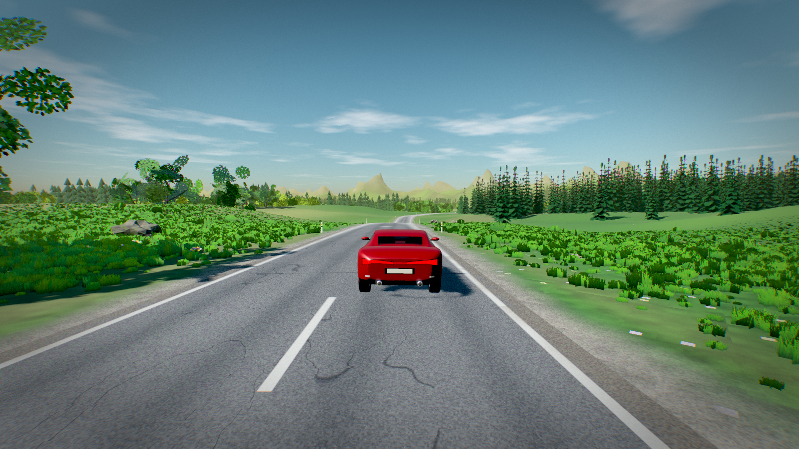

# Open Road

**▶ Play it in your browser: https://nikunjsingh93.github.io/open-road-horizon/**

A relaxing, endless-road driving game for the browser, built with **Three.js** and a
**Blender-authored** car. Everything else – terrain, road, forests, sky, water, weather, audio – is generated procedurally
at runtime. No asset packs.



## Run it

```bash
npm install          # once
npm run dev          # http://localhost:5199
```

or double-click `run.bat` (Windows). For a production build: `npm run build && npm run preview`.

The live version is served from the `gh-pages` branch; `npm run deploy` rebuilds and republishes it.

A recent Chromium browser with WebGL2 is required. Click the start screen once (browsers only allow audio after a gesture).

## Controls

| Key | Action |
| --- | --- |
| `W` / `↑`, `S` / `↓` | throttle, brake / reverse |
| `A` `D` / `←` `→` | steer |
| `Space` | handbrake |
| `L` | headlights: off → low beam → high beam |
| `E` / `Q` | shift up / down (when *Gearbox → Manual* is selected in settings) |
| `1`–`6`, `0`, `Z` | pick a gear directly in manual mode: gears 1–6, neutral, reverse |
| `C` | autopilot (relaxed cruising, follows the road) |
| `V` | cycle camera: chase · far · top · hood · cockpit (working steering wheel + instrument cluster) |
| `R` | recover onto the road |
| `T` | jump time of day, `G` cycle weather, `K` cycle car paint |
| `Shift`+`F` | full screen (also a button in settings) |
| `Esc` / `P` | settings menu (time of day, weather, season, world seed, graphics, audio) |
| Mouse | look around (click the game to capture the mouse, `Esc` releases it and opens the menu) |
| `H` HUD, `M` mute, `N` music, `F` performance stats |

**Touch screens** (phones / tablets) get on-screen controls automatically: steer ◀ ▶ bottom-left, gas / brake / handbrake bottom-right, camera · autopilot · reset · menu top-right, and drag anywhere else to look around. Desktop browsers never show them.

Gamepads work too (left stick, analog RT gas / LT brake-reverse, A handbrake, Y camera, X autopilot, B recover, D-pad up lights, bumpers shift, Start menu).

## What is in the box

* **Infinite procedural road** – smooth curvature-noise spline with gentle elevation, causeways over lakes with guard rails,
  delineator posts, painted lane lines, cracks, tar seams, wear, wet puddles, snow at the verge.
* **Terrain** – valley/mountain/lake heightfield carved around the road, quadtree LOD out to ~6 km, shader-based grass,
  gravel, rock, snow and wildflower detail, wind waves rolling across the meadows.
* **Vegetation** – hand-built procedural oaks, birches and spruces (trunk + branching + leaf-card canopies with translucency
  and wind), three LODs, `BatchedMesh` rendering, merged low-poly forests to the horizon, instanced grass, flowers, bushes, rocks.
* **Atmosphere** – physically based single-scattering sky (Rayleigh + Mie), procedural clouds, stars & moon, aerial
  perspective fog, sun glare and crepuscular rays, cascaded shadow maps, image based lighting rebuilt from the live sky.
* **World styles** – the default *Mix* strings every style together, a few km each, blending from one into the next:
  *Meadows*, *Lakes*, *Highlands*, *Deep forest*, *Mountain road* (the road climbs the flank of a range with a slope above and a
  drop below, switching sides as you go) and *Coastal cliffs* (a corniche high above the sea with rocky shelves and skerries).
  Each can also be chosen on its own. Sliders for road curviness and hill/mountain height, and a button for a brand-new random world.
* **Off-road side tracks** – dirt tracks branch off the main road roughly every kilometre and wind up into the hills.
* **Wildlife** – sheep, cows and deer with walking / trotting animation: they graze, stroll, and run from a fast car;
  they can be bumped. Flocks of birds circle overhead.
* **Oncoming traffic** – now and then a car of a random colour drives towards you in the opposite lane (no collision, can be switched off).
* **Weather & seasons** – clear, cloudy, overcast, rain, storm, fog, snow; spring (blossom, flowers), summer, autumn and winter (bare trees, snow
  cover, reduced grip). Day/night cycle with headlights.
* **Two cars** (Settings > Car > Vehicle) – a sport coupe and a luxury SUV (Range-Rover-style: 2.4 t, four wheel drive, soft and tall, more body roll, longer braking distances), each with its own physics numbers and camera / cockpit layout (`src/cars.js`).
* **Coupe** – generated by `scripts/blender/create_car.py` (Blender 5.2, headless) with modelled body, glasshouse,
  interior, lamps, exhausts, 10-spoke wheels with brake discs and calipers, exported to `public/assets/car.glb`.
* **Physics** – custom rigid-body vehicle: four raycast suspensions with anti-roll bars, brush-style tyre model with
  combined slip, weight transfer, engine torque curve + 6-speed automatic, traction control, ABS, aero drag & downforce,
  surface friction (tarmac, gravel, grass, wet, snow), tree collisions.
* **Audio** – fully synthesised engine, wind, tyres, rain, birds, crickets and a generative ambient music bed.
* **Polish** – skid marks, dust/smoke/spray particles, speed FOV and radial blur, camera shake, dynamic resolution scaling,
  quality presets (low → ultra), persistent settings.

## Regenerating the car

```bash
"C:\Program Files\Blender Foundation\Blender 5.2\blender.exe" --background --python scripts/blender/create_car.py -- ^
    --glb "%CD%\public\assets\car.glb" --decimate 0.4
# add   --preview "%CD%\shots\car"   to also render preview images

# the SUV (sheet-metal shell with boolean-cut windows, exported to public/assets/suv.glb)
"C:\Program Files\Blender Foundation\Blender 5.2\blender.exe" --background --python scripts/blender/create_suv.py -- ^
    --glb "%CD%\public\assets\suv.glb" --decimate 1
```

## Project layout

```
src/main.js        game loop, camera, input, settings
src/terrain.js     infinite road + height function      src/ground.js   road/terrain meshes & shaders
src/tiles.js       far terrain quadtree + lakes          src/sky.js      atmosphere / clouds
src/scatter.js     tree streaming                        src/foliage.js  tree library & leaf atlas
src/cover.js       grass, flowers, rocks, bushes         src/roadside.js posts & guard rails
src/vehicle.js     physics + autopilot                   src/car.js      GLB loader & materials
src/weather.js     rain / snow / fog                     src/audio.js    procedural sound
src/fx.js          particles & skid marks                src/ui.js       settings menu
```

## Notes

* three.js' CSM add-on ships an outdated `lights_fragment_begin` chunk that silently zeroes all specular lighting on
  r18x; `makeCSMSafe()` in `src/gfx.js` splices its cascaded-shadow block into three's current chunk instead.
* Dev-only helper: `window.__snap('name')` saves the canvas to `shots/name.png` through the Vite dev server.

## Performance

The first visit picks a preset from the device (phones, tablets, ≤ 4 cores, ≤ 4 GB RAM and integrated GPUs start on **Low**; change it any time in
settings). Low renders about 10× fewer triangles than High: no dynamic shadows (a soft blob under the car), half the trees drawn with the cheap
LOD only, coarse far terrain, no god rays / bloom / MSAA and a lower resolution. Low and Medium render at 90% of the native resolution (dynamic scaling is off there); on High/Ultra dynamic resolution runs, and if a device is still
below ~28 fps at the lowest resolution the game sheds shadows, then vegetation and view distance by itself.

**Low quality** uses a separate light-weight render path aimed at weak phones (e.g. Helio G100 / Mali): direct rendering with no post-processing target, no
image based lighting or shadow maps (one sun + a hemisphere fill), a sky whose atmosphere is computed per vertex with a single cloud texture, and cheap
terrain / road / water shaders, with ~a quarter of the trees and no grass, flowers, rocks or bushes (trees only). Resolution is 90% of native. Turn on *Show FPS* in the settings to see the frame rate top right.

## Install as an app (PWA)

Open the game in Chrome / Edge / Safari and choose **Install app** / **Add to Home Screen**. After the first load it works offline
(a service worker caches the game and the car model). It starts full-screen (manifest `display: fullscreen`, no title / status bar) in landscape. If an already-installed copy still shows the title bar, remove it and install again so the phone picks up the new manifest.
